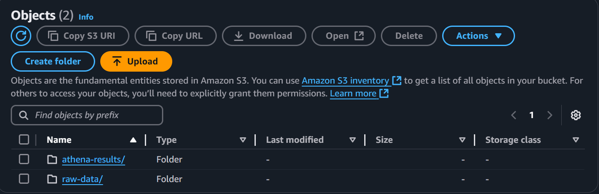
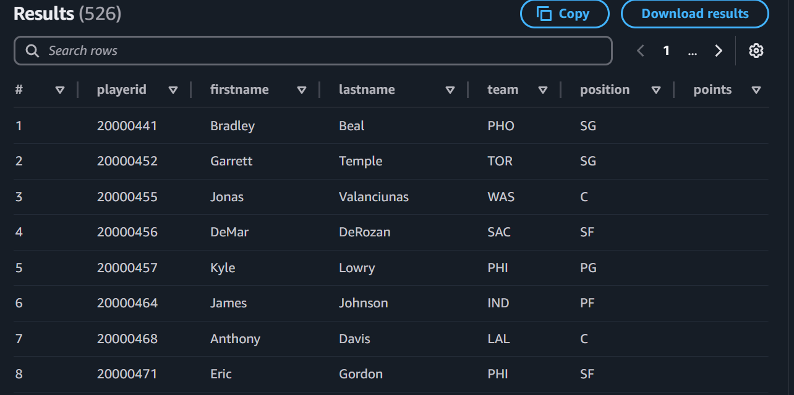
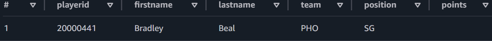

# NBA DATA-LAKE

## Overview
This system leverages Amazon S3 to store unprocessed data, creates a glue database to prepare the data for querying and configures Amazon Athea to query the data stored in the S3 bucket.

## Technologies used
- Programming Language: Python
- API: SportsData.io
- AWS Services:
    - Amazon S3: to store raw data fetched from the API
    - AWS Glue: Extracts and loads the data to prepare it for querying
    - Amazon Athena: To query data

## Architecture Diagram


## Create .env file
This file will have: 
- your unique bucket name(S3_BUCKET_NAME)
- api key from SportsData.io(SPORTS_API_KEY)
- NBA endpoint(NBA_ENDPOINT): the api endpoint where the data is being fetched from

## PYTHON SCRIPT: src/data-lake.py./
- The python script has 6 methods

```
create_s3_bucket:
    - Creates a bucket where the data is stored.
    - The bucket name is fetched from the `.env` file.

create_glue_db:
    - Initializes the Glue database.

fetch_nba_data:
    - Fetches the endpoint from the URL in the `.env` file and returns the fetched data.

upload_data_to_s3:
    - Converts the fetched data to line-delimited JSON using the `convert_to_line_delimited_json()` function.
    - Uploads the formatted data into the S3 bucket created earlier.

create_glue_table:
    - Creates a Glue table named "nba_players," which can be queried by Athena.
    - Defines the schema for the table, specifying the data types and location of the data that Glue will scan.

configure_athena:
    - Sets up the Athena output location.
    - Queries the data that is in the S3 bucket.
    - Executes SQL query to create the database "nba_analytics" if it does not exist.
    - Specifies where to store the result of the query execution.
```

## Executing the scripts
- Run python src/data-lake.py to execute the script:


- Resources created in S3.


- Raw data is stored in /raw-data and the query results will be stored in /athena-results.


## Querying with Athena
Now the data can be queried with Athena using SQL query commands:
e.g
In the Athena Query Editor tab:
`SELECT * FROM nba_analytics` will return:


`select * from nba_players where playerid=20000441` will return a single player:



